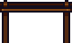
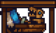

# Builder I: The Basics

  

## The builder class

There are three classes in KAG: the archer, the knight and the builder. Although a good team in Capture The Flag (CTF) should be mostly composed of knights, it's the builders who lead the team to victory. Out of 12 people in a full team, at least 3-4 should be builders. 

As a builder in CTF, your role is to make defences for your flags and base, build shops for your teammates, as well as set up siege and help your team advance and destroy the opposing team's structures, and finally -- capture the enemy flag. You have plenty of tools for that, and winning the game by leading your team is basically your main focus as a builder.

In this chapter we're going to explain all the structures you can place and items you can use as a builder, as well as talk a bit about building a good base and a tower. We'll also highlight some common mistakes that inexperienced builders can make.

 
 
## Getting materials

It has been mentioned in the in-game tutorial, but we'll mention it again. You can mine any blocks by holding the right mouse button.
There are 2 natural blocks that don't give any materials:

 

Bedrock can't be destroyed at all.

 

Dirt does not give any materials.

You can have up to 500 stone, 500 wood or 100 gold in one slot in your inventory (press F). You can take materials out of your inventory by pressing them with your inventory open (or closing the inventory while your cursor is on one of the slots). Wood and stone are taken out in stacks or 250 (or less if you have less than 250. The first taken out part is the full stack) -- so to throw out 500 wood, you'll need to throw 250 wood two times. Gold is taken out in stacks of 50.

<video style="display:block; max-width:100%; height:auto;" src="webm/01-basics/matthrow.webm" controls loop="loop" preload></video> 

### Stone 

 

Stone ore gives 4 stone per hit. Normal stone ores can be hit up to 6 times, so 24 stone per stone ore.

 

Thick stone ore gives 6 stone per hit for 6 hits, then 4 stone per hit for remaining 5 hits. Gives a total of 56 stone after 11 hits.

### Gold 

 

Gold ore gives 4 gold per hit, can be hit up to 5 times -- 20 gold per gold ore.

Keep in mind that **you can actually see gold ore** on the map -- press M and look for orange spots, like in the images below.

 
 
 
 
 

### Wood 

 

Trees need between 10 and 12 hits to fall down and drop logs. Trees have varying height, even when they reach their maximum height, but pine trees of maximum height drop 6 or 7 logs, while the smaller bushy trees drop 3, 4 or 5 logs. 

One log gives **10 wood per hit, 5 hits per log -- so up to 50 wood per a log.**

Trees of course can regrow after being chopped down. Although it also varies, it's between 30 and 100 seconds, with bushy trees regrowing faster than pine trees.

### Resupplies

 
 
This is an important mechanic that a lot of people overlook. During the building time (the first 180 seconds of a match), you can get free materials from the tent or a builder shop every 40 seconds. **You get 300 wood and 100 stone.**

**In game time, you get 100 wood and 30 stone every 20 seconds.**

Keep in mind that the materials stack, so if you were next to the tent for 60 seconds straight, you'd get 300 wood and 90 stone in game time. If you're staying in your base, it's good to constantly get resupplies -- it may not seem like much, but it adds up and you can eventually decently expand your base.

## Your building menu

In this section we'll shortly describe each of the blocks in the builder menu, which you can access by pressing F. A builder's building menu consists of 11 blocks/structures, as you can see in the image below:

 

Blocks can cost either wood or stone.

**Placing blocks gives you coins** - depending on what you're placing and if you're placing it during build time (the first 180 seconds where teams build their bases) or game time.

### Stone block

 

- Costs 10 stone.
- Gives 4 coins when placed in game time, 1 coin in build time.
- Can be destroyed by builders (7 hits), bombs (1 bomb if the bomb is next to the block) bomb arrows, kegs.
- Gives 1 stone per hit (7 stone total).
- The most basic block. Majority of your defences should consist of this block.

### Stone backwall

 

- Costs 2 stone.
- Doesn't give coins.
- Can be destroyed by builders (5 hits), explosives.
- Doesn't give stone on hit.
- You should support your stone block walls with stone backwalls.

### Stone door

 

- Costs 50 stone.
- Gives 4 coins when placed in game time, 1 coin in build time.
- Can be destroyed by builders (5 hits), explosives (5 bombs per 1 stone door!).
- Gives 5 stone per hit (25 stone total).
- Strong block, especially against enemy knights. However, quite expensive, so don't overuse it.
- Doors can only be opened by teammates.
- Doors should be placed next to a solid block, or else they will fall off after some time.

### Wood block 

 

- Costs 10 wood.
- Gives 1 coin when placed in game time, 0 coins in build time.
- Can be destroyed by builders (5 hits), explosives.
- Flammable -- can be put on fire by fire arrows and spread fire to nearby wooden structures.
- Destroyable by knights (5 slashes)
- Gives 1 wood per hit (5 wood total).
- You shouldn't overuse it -- burning wooden structures is extremely easy. However it's decent for some basic defences when you don't have stone.

### Wood backwall

 

- Costs 2 wood.
- Doesn't give coins.
- Can be destroyed by builders (2 hits), explosives.
- Flammable.
- Doesn't give wood on hit.

### Wood door

 

- Costs 30 wood.
- Gives 1 coin when placed in game time, 0 coins in build time.
- Can be destroyed by builders (4 hits), explosives.
- Flammable.
- Destroyable by knights (14 slashes)
- Gives 5 wood on hit (20 wood total).
- Doors can only be opened by teammates.
- Doors should be placed next to a solid block, or else they will fall off after some time.

[GIF]

### Trapblock

 

- Costs 25 stone.
- Gives 4 coins when placed in game time, 0 coins in build time.
- Can be destroyed by builders (5 hits), explosives
- Gives 2 stone per hit (10 stone total).
- Only enemies can pass through it -- commonly used to create traps.

### Ladder

 

- Costs 10 wood.
- Doesn't give coins.
- Can be destroyed by builders (2 hits), explosives
- Destroyable by knights (2 slashes)
- Gives 3 wood per hit (6 wood total).
- Can be climbed by holding W while on them
- Ladders are 3x1. You can rotate them by pressing Space after selecting one.

 

- Ladders can overlap. The center of a ladder is the team-coloured part. You don't have to place the centres next to each other -- if you want to build a few ladders on top of each other, there can be a 1 block gap between the centres. This saves some wood.

[GIF: overlapping ladders, not overlapping ladders]

### Platform

 

- Costs 15 wood.
- Gives 1 coin when placed in game time, 0 coins in build time.
- Can be destroyed by builders (5 hits), explosives.
- Flammable.
- Destroyable by knights (10 slashes)
- Gives 2 wood on hit (10 wood total).
- You can only go through one way of them.
- You can rotate them with space if you want different directions.
- Also places a wooden backwall behind when you build one.
- Even though enemies can't go through their solid side, they can still attack you through it -- make sure to not get too close.

### Workshop

 

- Costs 150 wood.
- Gives 10 coins when placed in game time, 3 coins in build time.
- Can be destroyed by builders (4 hits), explosives.
- Flammable.
- Destroyable by knights (8 slashes)
- Doesn't give wood on hit.
- 3 blocks wide and 5 blocks tall.
- Can be converted to one of the 9 CTF shops after being built. We'll talk more about them in the next section.
- Places some wooden backwall behind one.

### Spikes

 

- Costs 30 stone.
- Gives 4 coins when placed in game time, 1 coin in build time.
- Can be destroyed by builders (2 hits), explosives.
- Doesn't give stone on hit.
- Can be placed on any solid blocks. Does damage to all players -- including teammates -- when they walk into one.
- If placed on a stone block, the spike retracts and only activates when there's an enemy near it (keep in mind it's not instant, though)

[GIF: spikes on wood/dirt, stone, retracting, walking]

- If not placed on a solid block (for example, on backwall or next to a door or platform), the spike falls and damages the players it falls on. The spike deals damage depending on how much distance it fell from -- spike damage increases by 1 heart for each block it travels. For example, if a spike was placed on a backwall and there were 2 blocks between that backwall and the player, the player would get 2 hearts of damage.

[GIF: falling spikes]

## Workshops, items, siege

After you place a workshop (150 wood), you can convert it to one of the 9 different shops. Most of them also cost wood, but some cost stone and gold as well. In this section we'll talk about all the different shops and builder-related items and vehicles you can buy in them.

All enemies are also able to use your shops -- place them carefully.

### Builder shop

 

Costs 50 wood. One of the three class shops -- if you aren't the class of the shop (if you aren't a builder in this case), you have the option to change to builder on it. The second option (for all classes) is to open the shop.

 

 

Now, let's talk about the items you can buy:

#### Lantern

 

- Costs 10 wood.
- Generates light.
- 1x1 size in inventory.
- Can be turned on and off with Space button.

#### Bucket (no water)

 

- Costs 10 wood.
- 1x1 size in inventory.
- Fills with water if you put it in water.

#### Bucket with water

 

- Costs 10 wood and 10 coins
- 1x1 size in inventory.
- You can press left mouse button while you have one in your hand to splash water. The water can extinguish fires, as well as extinguish a lit keg (which is unique for the water bucket -- water bombs or water arrows can't do that). You can make up to 3 water splashes before the bucket becomes empty and requires refilling.
- Can also cool a heated drill

[GIF - extinguish fire]
[GIF - extinguish keg]
[GIF - cool a drill]

#### Sponge

 

- Costs 15 coins.
- 1x1 size in inventory.
- You can use it to remove water blocks, like in gif below.

[GIF]

- If you have one in inventory and you get hit by a water bomb or a water arrow, the sponge will absorb the stun. This can happen up to 2 times before the sponge gets destroyed.

[GIF]

#### Boulder

 

- Costs 35 stone.
- Around 2x2 size (2 blocks wide and tall)
- Doesn't fit in inventory (3x3 size, so it fits in storage).
- You can throw it at enemies to damage them.
- The damage depends on the velocity of the boulder; for the most damage, you should throw the boulder from the top of your tower.

[GIF]

- If you put a boulder in a catapult and then launch it, it has a new functionality -- it also goes through blocks. Some believe this is a bug, but it works like in the GIF below.
  
[GIF]

#### Trampoline

 

- Costs 150 wood.
- 3 blocks wide, 1 block tall.
- Doesn't fit in inventory.
- Lets players bounce of it.
- When hold in your hand, you can rotate it to 3 directions so that it points up or diagonally.
- Often put on top of the towers so that your knights can travel lots of distance.
 
[GIF]

#### Drill

 

- Costs 100 stone and 25 coins.
- 1x1 size in inventory.
- Builders (knights and archers can't) can use a drill by holding left mouse button while you have one in your hand. It destroys blocks much more quicker than if you were destroying them by pickaxe. The drill also destroys 2 blocks in front of the drill. 
- Drills rotate depending on the position of your cursor.
- The more blocks you destroy, the hotter the drill gets -- eventually it can overheat and deal you 0.25heart of damage and drop to the ground while releasing steam. If that happens, don't instantly try to pick it back up -- it will damage you and keep dropping to the ground. You have to wait a few seconds.

[GIF]

- Overheated drills emit light, so you can sometimes spot rats with drills.

[GIF]

- Drills also deal 1 heart of damage to enemies per hit. When they are in a heated state (they have a red tint), they deal 1.5 heart of damage.
- Drills deal half of the damage when shielded -- so 0.5 heart or 0.75 heart of damage to shielding knights.
- They obviously also deal damage faster than pickaxe.

[GIF]

- Drills can be cooled down by using any kind of water on it (water bomb, water arrow or water bucket). They also cool down naturally over time. They also cool down while in your inventory. You can speed up the cooling down slightly if you move around with your drill in hand. There's also a bar that shows you how heated a drill is.

[GIF]

- Drills overheat quicker on natural blocks (stone ore, dirt) than on man-made blocks (stone blocks, wooden blocks). They also overheat even quicker (the fastest) on blocks such as doors, platforms or shops, as well as on trees.

[GIF]

- Drills have an odd angle, which allows you to damage enemies in a situation like in the gif below (pay attention to what is a door and what is a normal block), while the knights can't damage you. This is a bit more advanced and is related to doors having a slightly bigger hitbox -- we'll tell you more about it in another chapter in a combat-related section. 

[GIF]

#### Saw

 

- Costs 150 wood and 100 stone.
- 3 blocks wide, 2 blocks tall.
- Doesn't fit in inventory.
- You can press E on the saw to turn it off and on.
- Players instantly die if they fall into a saw.
- If a teammate falls into a saw, the saw turns off.

[GIF]

- Saws change team depending on who last held the saw. You can't pick up enemy saws from above or from their side. You need to be at a lower level than them.

[GIF]

- Another functionality of saws is that they convert logs into wood quickly. More about this will be mentioned later this chapter (building a "tree farm").

[GIF: throw saw at some logs]

- Items like crates also get destroyed when thrown into a saw.
- Lit bombs and kegs explode instantly when thrown into a saw.

[GIF]

#### Crate

 

- Costs either 150 wood or 20 coins.
- 3 blocks wide, 2 blocks tall.
- Doesn't fit in inventory.
- A crate has a 3x3 inventory -- you can put items in it. The crate should be on the ground, while you should hold the item you want to put in a crate in your inventory then press E on it.
- If you hold a crate and walk over items such as materials or unlit bombs laying on the ground, the crate will pick them up. They can be removed out of the crate manually or by pressing Space while having it in your hand.

[GIF]

- Players can also get into crates -- you need to pick a crate up (so that it's your hand), and then press E on it. Other players can also pick up the crate. This is a good way for builders to be "delivered" to enemy territory safely by the knights in your team.
- You can get out of a crate by pressing E again.

[GIF]

- You can remove enemies from enemy crates by pressing E on it, however, it will stun you for a short time.

[GIF]

That's all of the items in the builder shop.

### Quarters

Costs 50 wood. The shop has 2 features -- if you aren't at full health, you can select the sleep button and regain 0.25 heart per second.

[gif - sleeping]

The other button is opening the shop menu, which contains 4 options -- a beer, a meal, an egg and a burger.

#### Beer

- Costs 5 coins.
- Gives you 1 heart of health -- it's worth buying only if you need 1 heart to full health.

#### Meal

- Costs 10 coins.
- Refills your health to full.

#### Egg

- Costs 30 coins.
- 1x1 inventory size.
- If you walk over an egg while damaged, you will eat the egg. However, it's not exactly a food item -- after some time a chicken hatches out of the egg. If you hold a chicken in your hand, you fall slower. If there are 2 or more chickens, they also breed and produce more eggs.
- Chickens are pretty much only used if you want to travel more distance when being launched out of a catapult.

[GIF - being launched out of catapult]

#### Burger

- Costs 20 coins.
- 1x1 inventory size.
- It's an item which you can carry around, unlike the first 2 options. It refills your health to full. You can also give burgers to others.
- If you have a burger in your inventory (this also applies if you have a heart in your inventory), and you don't have full health, you can press V to quickly heal.
- When two builders have a 1v1 pickaxe fight, the deciding factor is usually if someone has a heart or a burger. If you have some free space in inventory you could carry a burger for such situations. It's also useful when you get slightly damaged by a bomb.

### Knight shop

Costs 50 wood, another class shop -- so you have the option to swap class to Knight or open the shop menu. Since this is a builder guide, we're focusing only on the items which you can use, which in this case would be the mine.

#### Mine

- The 3rd item in the knight shop.
- Costs 60 coins.
- 1x1 inventory size.
- When you put one on the ground, it deploys after being still for 1.5 a second.
- Instakills any enemies that walk into it and causes a small explosion.
- Unshieldable by knights.

[GIF]

- If the person who placed the mine was next to it during the explosion, they also die.
- You can pick up enemy mines if they haven't deployed yet. The mine changes to your team if you do that.

[GIF] 

- It's a good tactic to put mines in your flag rooms or next to enemy doors.
- Sometimes people also put them behind bushes or trees.

[GIF]

### Archer shop

Costs 50 wood, is a class shop. Sells special arrows for archers.

### Naval shop

Costs 100 wood and 50 gold. Sells boats -- this shop is pretty much useful only on maps with lots of water.

All enemy boats are capturable if you stay on them for long enough.

#### Dinghy

- Costs 150 wood.
- 6 blocks tall, 1 block wide.
- Two people can enter a dinghy.
- Weakest out of all the boats.
- You can enter a dinghy by pressing S on it. Row the boat by holding A or D.
- The more people that row the boat, the faster it goes.
- Has a 6x5 storage (press E to open it. As mentioned earlier, in order to put something in a storage, you must have an item in your hand and then press E on the storage button.)

#### Longboat

- Costs 200 wood and 50 coins.
- Comes in a crate when bought -- it must be unpacked in water.
- Has 6 rowing spots (press S to enter one)
- Fastest out of all the boats -- especially if rowed by 6 people.
- Has a 12x5 storage.
- Longboats crush enemies when fast enough.

#### War Boat

- Costs 250 coins.
- Comes in a crate when bought -- it must be unpacked in water.
- Slower than a longboat, but also the hardest to destroy.
- Has 6 rowing spots.
- Has one mounted bow on top which lets you shoot arrows (press S to get in).
- Has a 12x6 storage.
- You can change class on a war boat by holding E and selecting the "change class" button.
- War boats are also respawn points (if you die, you can respawn at a war boat). You can't respawn on a war boat if there are enemies on it, though.
- They also crush enemies when fast enough.

### Siege shop

Costs 100 wood and 50 gold. Lets you buy siege vehicles -- catapults and ballistas. They're quite useful, and gold is rare on some of the maps, so make sure you place a siege shop in a secure place.

#### Catapult

- Costs 80 coins.
- Comes in a crate when bought -- it must be unpacked in a spot with enough place.
- It has 3 spots right after unpacking: the driving spot, the firing spot, and the spot in the bowl. You enter the spots by clicking S on them, obviously. For the upper spot in the bowl, you have to jump up first and then press S.
- You can remove the wheels by pressing E and clicking the remove wheels button. You should do this pretty much every time if you plan the catapult to be a stationary one on top of your tower. This removes the driver spot and can't be undone.

[GIF of removing driving spot]

- Catapults can launch items, as well as players. When you enter the firing spot, you can launch by holding your left mouse buttons.

[GIF of launching a player]

- If you want to put an item in a catapult, you must first have the item in your hand and then press E on the button next to the bowl.

[GIF - put boulder and then launch]

- Catapults can also fire rocks. Each catapult after unpacking has 100 stone. One rock launch costs 10 stone. They do some slight damage to structures, especially backwall

[GIF of above]

- You can refill catapults with stone by clicking the "Load stone" button if you have stone in your inventory.

[GIF of above]

- You can shoot stuff through platforms too, obviously.

[GIF of platforms]

- Keep in mind that enemy archers can destroy your catapult with only a single bomb arrow.

[GIF]

- Also, if you haven't removed the wheels, archers can shoot the catapult and make it drive away. This can cause the catapult to fall off sometimes, which is why removing wheels is recommended.

[GIF]

#### Ballista

- Costs 200 coins.
- Comes in a crate when bought -- it must be unpacked in a spot with enough place.
- Has a driving spot and a firing spot.
- You can remove the wheels (same as in catapult). Press E and select the "immobilise" option.
- A ballista spawns with 12 bolts. More can be bought in the shop.
- If you haven't upgraded the bolts in the vehicle shop (last option), the firing spot can shoot normal bolts that instakill enemies if they hit them.

[GIF]

- If the bolts are upgraded, the ballista fires explosive bolts instead that damage structures too. However, it consumes 2 bolts instead of one (so if a ballista has 12 bolts, it actually only has 6 explosive bolts)

[GIF]

- You can also change classes on ballistas -- hold E and select the "change class" option.

[GIF]

- Keep in mind you can change class on enemy ballistas too.

[GIF]

- They also work as a respawn point, similar to war boats. If you die and your team has a ballista, you can select it to respawn on it.

[GIF]

- You can't respawn on a ballista if it's being captured by the enemies (capturing any vehicle in KAG means standing on it for some amount of time).
- Keep in mind that enemy archers can destroy your ballista with two bomb arrows.
- Similar to catapults -- enemy archers can shoot arrows at a ballista with wheels and make it drive away. Removing wheels is recommended.

#### Ballista bolts

- Costs 100 coins.
- One stack of 12 ballista bolts.
- Put new ballista bolts in a ballista by holding them in your hand, holding E on a ballista and selecting the "load ballista bolts" option.

[GIF]

#### Bomb bolt upgrade

- Costs 100 gold.
- When bought, it applies to any future ballistas bought by your team in the match, even if it's a different siege shop.
- Future ballistas will now fire explosive bolts, as mentioned earlier.
- Keep in mind that this upgrade does not apply to ballistas you have bought before getting the upgrade.

### Storage

- Costs 50 stone and 50 wood.
- Has a 4x2 storage which lets a team store items.
- Holding E and clicking the "Store" button will put all the items in your inventory into the storage.
- If you want to put a single item into the storage, you must first hold it in your hand, then select the other "Storage" button.
- Harder to destroy than other shops.
- Good for storing gold, as well as excess wood and stone that you don't currently need.

### Tunnel 

- Costs 50 gold, 100 stone and 50 wood.
- If you have 2 or more tunnels, you can quickly travel between them.
- If you have only 2 tunnels, just pressing E on the tunnel will let you travel to the other one.
- If you have 3 or more tunnels, you will also have to select what tunnel you want to go to.

[GIF]

- You are stunned for a second after using a tunnel.
- Tunnels usually should connect the most important parts of the map for your team: there should be one next to the tent, one in the tower, one or more in middle of the map (if you have control of it).

### Quarry

- Costs 150 stone and 100 gold.
- There's a limit of only 1 per team.
- You can put wood into a quarry in order to convert it to stone. If you have wood, just hold E and press the "add fuel" button.
- Can hold up to 500 wood.
- Converts 100 wood to 75 stone every 30 seconds.
- The stone falls to the ground on the 2nd tile of the shop from the left. Since it falls like that, many people put quarries above a storage with a 1 tile gap so that the stone goes into the storage like in the gif below.

[GIF]

## Building a base

The build time is the **first 180 seconds of the match** with an uncrossable red zone in the middle. The point is to obviously build a decent base before you start fighting with the opposing teams. The more builders in a team know how to make good defences, the more likely it is that you're going to win (or at least lose slower).

Of course, if you want to, you can keep building the base after the build time ends. Often there's still lots of materials left, so you can keep improving the base.

### A front tower

Besides having your flags be well protected, having a decent tower is also very important. A good way to start building a front tower in 40 seconds is to build some ladders up, add some stone backwall and then build a **builder shop** like in the image below. Make sure to not place more than 10 ladders so that you have enough materials for a builder shop.

If you decide to focus on the tower for the entirety of the build time, you're most likely going to work around here. As mentioned earlier, the builder shop lets you get resupplies -- you should walk to one every 40 seconds (on around 140 seconds left, 100, 60 and 20) to get **free 100 stone and 300 wood.** 

Usually you end up using all the materials you have before the next resupply, so if that happens you should go dig some stone and return for the next batch of resupplies.

Keep in mind you can't make everything by yourself in an actual CTF match of course -- this is a team game after all, so other players should help you and also build a bit. You should pretty much build what is missing or improve the parts that could be better. This part will just tell you how a good tower should look like.

After building a builder shop, it's good to make the front wall. Usually making a 3 block thick wall is enough.

We start with placing 3 layers of doors at the bottom -- 5 wooden doors and 1 stone door. We don't want to place too many stone doors so that we have enough stone for the actual wall itself.

After placing the doors we place stone walls. **Keep in mind you can actually place blocks in the red zone!** Usually I build it like this:

First, the outer layer made out of stone only:

After that, the middle layer is going to be wood:

Replace every 4th or 5th wooden block with stone -- so that if the outer layer gets broken, the archers can't burn the entire middle layer at once:

And then the inner layer, stone only:

That's a solid front wall already. If you have some stone left, it'd be good to add some more backwalls so that the tower isn't too easy to collapse.

Okay, so we have a builder shop and a basic front wall. However, a good tower obviously has more. 

It'd be good to have the most basic shops in a tower + a tunnel. It's good to have a tunnel above the builder shop, then a knight shop (close to the tunnel, because majority of your team should be knights) then an archer shop (on top, because that's where defensive archers can shoot from). A food shop could be useful as well.

Somewhat like this:

The empty shop is going to be a tunnel later -- we need to find some gold first.

It's good to have lots, **lots of doors** -- in case the enemies get into your tower, the enemy builders will usually not be able to block all the doors and your knights will be able to defeat them by using doors to their advantage. So it can look somewhat like this, with every shop having 6 sets of doors:

Next, you want to replace majority of the wooden backwalls from the shops and doors with stone backwalls. **Fire spreads much slower and much less with stone backwalls than if there were wooden backwalls.**

[

Here's a comparison of using a fire arrow:

With stone backwalls:

[GIF]

With wooden backwalls:

[GIF]

Obviously, you don't want the front wall to be thinner above. We build additional 3 layers of wooden doors next to every shop (again, the more doors there are -- the harder for enemy builders to block them all) and add stone.

The bottom could use some work too. Add some more doors and stone blocks, so that if the enemies get through the first set of doors they don't have too much space to fight, and so that the tower is harder to collapse.

Sometimes you can choose to add a bit of platforms somewhere too, for example on the top, so that defensive archers can be protected from enemy arrows. Stone backwall is advised again.

Adding a trampoline after the game starts (the red zone bounces it back) is also good.

If you have wood left, you can place doors pretty much everywhere. The more doors the better.

Here's a 3 min video example of what you could do solely by yourself:

[VID]

And here's one for building a tower at a normal CTF match:

[VID]

### Flag rooms

Flag rooms should have at least 2 entrances, preferably 3, so that if one gets blocked you can still use the other ones -- one from the top and two from the sides, like this:

Keep in mind that stone doors like that are enough; wooden doors are pretty powerful. You don't need to overuse stone doors.

The doors from the tent's side should be on floor level so that knights can quickly get there. However, the one on the right side -- from the enemy's side -- shouldn't be placed like that; worse players can sometimes open the entrance accidentally and die, letting enemies get into the flag room. Making the entrance not on floor level usually prevents this.

Of course, the thicker a flag room is, the better -- if you have lots of materials, you can make it as thick as you want. If you lose the flags you lose the game, after all.

However, if you're making it thicker, it's good to have some additional doors for easier movement. 

It's also good to put a mine in each flag room (or even 2!). If any enemies eventually come to the flag, they will have to destroy the mine first and often they will just walk into it accidentally.

### Tunnels

As I mentioned earlier, there should be a tunnel in your tower for quick travel. The other tunnel should be next to your tent (or at least close to it).

The tunnel near your tent **should always have a sawtrap**. A sawtrap like this -- one trapblock, the tunnel on it and a saw below:

Here's how to build one -- as you can see, you can put a trapblock before putting the saw -- if you want to put the saw in the hole, you can just jump on the trapblock, hold S and throw it downwards.

[GIF]

### Tree farm

A tree farm is very useful to all the builders in your team -- it lets you get lots of wood easily, which also lets you get stone from quarries.

The idea is to place trees next to each other with 1 tile gaps, and have them be seperated like this:

After that, you get a saw and put it like this.

Destroying the trees will now make all of the logs fall downwards instead of the tree falling to the side. The logs, when destroyed by the saw, are converted to wood. This is much quicker than if you were chopping them manually.

[GIF]

If you have a bigger tree farm, you don't have to get another saw -- you can just move the saw around.

[GIF]

Also, if you have a saw, it's actually faster to chop down trees as a knight than as a builder -- a slash can damage 2 trees at once. So if the tree farm is near the tent you could quickly swap to knight to do that.

[GIF]

Trees can grow on bedrock, dirt and stone, but they can't grow on man-made blocks like stone blocks or wood blocks.

Also, sometimes it may bug out and the logs may not fall through and instead get stuck on the top. I believe this doesn't happen as often if there's more blocks vertically seperating the trees, like in the image below.

If for some reason the logs do not fall into the saw (or it was accidentally turned off), you can just throw the saw at the logs, like in the gif below.

[GIF]

### Shops

It's good to have some shops outside of the tower too, in case the ones in the tower get destroyed. Usually you should have some near the tent.

Make sure that you replace some of the wooden backwalls with stone backwalls so that it's not as easy to burn. Also, make sure they have good protection (doors) so that the enemies can't get in too easily.

## Block support -- wood and stone blocks

For now you should also remember that wooden blocks (normal wood blocks, platforms, doors) require less support than stone blocks. For example, if you tried to build a bridge, a stone bridge from top of your tower would only be 5 blocks long, while a wooden one would be able to be 25 blocks long.

[GIF]

This can often cause confusing situations when you can't place blocks somewhere -- there's not enough support. For example, if you replaced first half of a wooden bridge with stone, you wouldn't be able to build past the 5 blocks.

[GIF]

## Common mistakes

There are lots of mistakes that can be made by beginner builders or just less advanced players. Here are some of the most common ones.

### Leaving shops in the open

Sometimes less experienced players build shops in the open. This is dangerous, because if any enemies get into your base (by bomb jumps or by catapult, for example) then they will be able to use them -- change class or buy items (e.g. kegs)

If you see a shop (mostly knight and builder shops) like that, you should either destroy it if it's in a bad position or encase it with at least some doors and stone blocks. However, if they shop is close to the flag, they're an even bigger danger so you should just destroy them.

### Overusing stone doors

Sometimes people think that wooden doors are too weak and overuse stone doors, like in the image below.

[IMG]

This is pointless and a total waste of mats. Destroying stone doors by builders takes only slightly longer than wooden doors. The stone should be rather used on additional layers to the tower rather than stone doors. Comparison with same amount of stone used as in image before:

[IMG]

### Overusing wood, not placing stone backwall

If you overuse wood, structures are way too easy to burn. If you're putting lots of doors, put stone backwall behind all of them, same with shops. If you need to make some wooden defences due to lack of stone, you should still try to mix in at least some stone between wooden parts so that everything doesn't burn at once.

[IMG]

[IMG 2]

### Awkward top doors

Sometimes there are doors like this:

[IMG]

It's harder to go through doors like that because you need to jump up and fit properly. This is much easier when doors are to the side, like in the image below -- in this case you can wallclimb by hugging the wall and it's much easier.

[GIF]

### Awkward movement in general 

It's important for your knights to be able to move fast in case of incoming enemies, and sometimes odd block placement can cause slower movement around the base. One example is doors not being on floor level when there's no reason to not put them like that:

[IMG]

Another example is not having the tunnel in the tower be next to outside doors -- this causes knights to waste time to go to other doors, like this

[IMG]

One block gaps in the floor like this are a bit annoying too -- you can sometimes get slightly stuck in them and shield sliding through them as a knight is slower.

[IMG]

### Not enough doors 

Slightly related to above, not placing enough doors. There should be lots of doors on the top part of the tower so that enemy builders getting up the tower don't block them all easily. There should be enough doors near the shops too, for similar reasons.

[IMG]

### Certain shops at the bottom of the tower

The bottom of the tower is more easily accessed by enemies than the upper parts. You shouldn't place shops like knight shops there (the enemies could buy some kegs after getting there for example).

[IMG]

You also shouldn't place knight shops near the flag room for similar reasons.

[IMG]

### Bad trapblock placement, bad traps, dirt spikes

Enemies can often use enemy trapblocks as doors. You should not use them too much -- they're only good for sawtraps.

For example, with a trapblock like this, the enemy builder could quickly build something like this and start drilling into your tower. Knights wouldn't be able to destroy the trapblock with bombs.

[IMG]

A trap like this is pretty bad too -- an enemy builder could just get in, destroy the spikes quickly and then again, he would be able to easily protect himself from knights.

[IMG]

If you really want to make a trap, it's good to have some doors that lead to the spike part, like this:

[IMG]

Or better, just use a saw.

[IMG]

This also applies for making a trap under a tunnel -- don't make a spike trap, because a builder could just use the tunnel and fall into the spike trap and destroy the spikes. Use a saw.

This is a classic example of a totally useless trap -- the trapblocks are a waste of stone, the spikes are on dirt, and there's no way for the team to go to the bottom part. Also, it's in the team area (before the flag), so it won't even kill any enemies.

### Putting a saw in the flag room

There's barely any reason to do this; it's better to have a top entrance so that you can protect the flag if there's enemies above rather than a saw. The saw can be easily avoided by placing ladders and often someone in your team will just accidentally kill themselves, disabling the saw (and also taking away coins from you -- you lose coins when teamkilling somebody).

[IMG]
