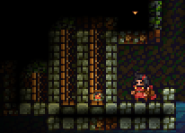

# Builder II: Defensive playstyle

  

## What you're going to focus on

As we mentioned in the chapter earlier -- defensive builders mainly stay in their base and focus on constantly making improvements, mining resources, keeping your team's quarry running, repairing structures and protecting the tower. In this chapter we'll mention some stuff you could do as a defensive builder.

## Resource management

As a builder, you always need materials to do something -- even in a progressive or offensive playstyle. Some of your time should be spent on getting such materials.

Of course, you want to have a tree farm (preferably with at least 3 trees, but the more the better) with a saw and a quarry -- this will let you both get wood and stone easily. You should always cut down trees when they reach maximum height, and make sure quarries are running -- you should refill them every 2 minutes (100 wood gets converted to 75 stone every 30 seconds; a quarry has a limit of 500 wood).

If your tree farm doesn't have enough trees, you should get some trees from the middle of the map -- cut them down and take the seed. Small thing to keep in mind here: you'll usually have problems with picking up and you will pick up logs instead of the seed. Hold C and move your mouse around until it says that you're actually selecting a seed. 

<video style="display:block; max-width:100%; height:auto;" src="webm/02-defense/seedup.webm" controls loop="loop" preload></video> 

Second thing to remember about -- a seed changes into a tree after a relatively short time, but it still shows a seed. You can't pick it up, so you need to hit the "seed" a few times again until you can pick it up again.

<video style="display:block; max-width:100%; height:auto;" src="webm/02-defense/seedgan.webm" controls loop="loop" preload></video> 

Another thing to keep in mind: trees can't grow next to each other, like in the image below. There needs to be at least 1 block gap between the seeds. The seed in the image will turn into a tree only once the tree next to it gets chopped down.

It's good to have a storage under a quarry as mentioned in the previous chapter -- if stone lays on the ground, it can decay after some time.

<video style="display:block; max-width:100%; height:auto;" src="webm/01-basics/quarry.webm" controls loop="loop" preload></video> 

Besides quarries, you should make use of the resupplies in game time. Remember -- every 20 seconds you can get additional 100 wood and 30 stone from a builder shop or a tent just by standing on it.

Of course, if you want even more stone, you can just go and mine stone ore. Most of the maps have quite a bit of it, so if you don't see any you could try digging around.

## Base expansion

As a defensive builder, what you want to do most of the time is usually expand your base. There are different ways to expand your base.

Before starting expansion, make sure that there's a tunnel (the workshop) connecting the tent and the tower. Saves a lot of time for your teammates -- it's a must.

The easiest way to base expand is to constantly add layers to your tower (the one you make in build time). There are a few ways to do it as well.

First way -- keep adding doors+stone block layers, such as this:

<video style="display:block; max-width:100%; height:auto;" src="webm/02-defense/expand1.webm" controls loop="loop" preload></video> 

However, eventually the wall will become so thick that if one of the doors will be blocked, you will have to backtrack too much to get to the upper doors. To make movement a bit easier it's good to make doors for moving upwards. Generally we can build 3 additional layers + doors upwards + 3 additional layers and so on, like in the image below

Of course, you could also do 2 layers instead of 3 or add more doors instead of so many stone blocks if you have wood.

You can also expand by just building what I like to call "door lettuce". This is good especially if you have lots of wood. Basically, you keep building doors with stone blocks connecting each pair. Make sure to add some stone backwall too. This is even harder for enemy builders to block, as well as allowing good movement for your knights.

Second way is not directly expanding the tower, but making a wall 10-15 blocks away from the front tower and then connecting it, but without as many layers -- mostly some wood and backwall. This works well on maps that are a bit bigger.

After that you can just pretty much make improvements -- make it taller, make the connection stronger, add aditional doors and so on.

No matter what way of base expansion you're using, you'll eventually probably want to move the tunnel forward (to save time for your teammates), as well as place additional shops.

If you have decided to finish base expansion for now you should add downward facing platforms after the doors -- like this. This makes it harder for enemy builders to climb up your tower.

The 1 block gaps are for spike dropping -- spikes can't drop through platforms at all.

## Different functionality of platforms

Now, one additional thing that is not really related to base expansion, but to building defences in general -- using additional platforms between stone layers. As mentioned in the first chapter, when making 3-block thick walls you can put wood blocks in between to not use as much stone. However, some people put platforms, and this can be kind of bad if the enemy team has good archers.

The good thing about it is that drills overheat quicker on platforms (as well as on doors) than on normal blocks:

<video style="display:block; max-width:100%; height:auto;" src="webm/02-defense/overheatquick.webm" controls loop="loop" preload></video> 

Keep in mind that when drilling platforms like that, you also drill the blocks behind them at the same time.

Although protection from drills is good, the con here is that bomb arrows destroy the middle layer of platforms when they hit the outer stone layer as well. This is the con of using platforms. Doesn't matter which directions they're facing.

<video style="display:block; max-width:100%; height:auto;" src="webm/02-defense/bombplatofrms.webm" controls loop="loop" preload></video> 

However, they can absorb all the damage from bomb arrows in certain situations: when they're facing away from the enemy side and they face a block (gif below) a bomb arrow will only damage a single platform and nothing else.

<video style="display:block; max-width:100%; height:auto;" src="webm/02-defense/platformprot.webm" controls loop="loop" preload></video> 

Keep in mind that even if it's like in the gif below (additional stone layer), a single bomb arrow still damages the platforms.

<video style="display:block; max-width:100%; height:auto;" src="webm/02-defense/bombplat2.webm" controls loop="loop" preload></video> 

So, as you can see -- although platforms are good against drills, they're not that good against bomb arrows in most of the situations. However, if you want to stop base expanding, then an outer layer consisting solely of platforms would be a good idea.

They're also viable for blocking tunnels -- it's very unlikely for enemy archers to use bomb arrows in tunnels, so you can block tunnels by using platforms between stone layers.

You can also use them on skybridges or ledges (when facing downwards), like in the gif below -- any bomb arrows that will hit the platforms from above will only damage a single platform and not do much damage to the ledge. 

<video style="display:block; max-width:100%; height:auto;" src="webm/02-defense/ledgeplat3.webm" controls loop="loop" preload></video> 

Comparison -- with platforms and without:

<video style="display:block; max-width:100%; height:auto;" src="webm/02-defense/ledgeplat.webm" controls loop="loop" preload></video> 

Keep in mind this only provides protection from bomb arrows, not firearrows. As for fire, you should have a builder shop around if you're using lots of wood so you can buy water buckets to extinguish fire.

## Setting up siege on top of tower

It's good to have a ballista and a catapult on top of your tower. As mentioned in previous chapter, you can buy a ballista for 200 coins from the siege shop, and a catapult for 80 coins. Ballistas can shoot explosive bolts (if you bought the upgrade) and let people respawn on it when they die, catapults can launch teammates.

First, you want to make a small (or a bit bigger -- depends on how far you want it to be able to shoot) ledge on top of your tower. Put some wooden blocks, and then one or two layers of stone blocks on top of it (wooden blocks provide more support than stone blocks, letting you build further). Make sure to not build it too close to the sky border (if you build it too high, you may not be able to unpack siege or build additional protections for it)

Generally, if you plan to shoot bolts from the ballista, or if you're placing a catapult you should build some platforms (and stone backwall!) like in the gif below:

<video style="display:block; max-width:100%; height:auto;" src="webm/02-defense/cataplatform.webm" controls loop="loop" preload></video> 

This provides good protection against enemy bomb arrows, as well as from enemy knights that may bomb jump to your tower. However, keep in mind that even with stone backwall platforms can still burn, so it's good to have a builder shop or a water bucket around to extinguish fires.

If you do not have explosive bolts or the bolts wouldn't do any damage to enemy structures, you want to encase your ballista in some thicker stone block defences, such as in the image below. Also, it's better to just do it on top of your tower instead of on a ledge -- a ledge can be collapsed.

People will still be able to respawn and it'll be very hard for enemies to damage a ballista like this.

Knights are likely to make use of your catapult -- if you see any knight get into the bowl, you should launch them. This is one of the most useful things a defensive builder can do for their team -- constantly launch knights to the enemy side.

Another thing you could do is set up a chicken farm -- make a small room like the image below, and put a few eggs there (buy them from a food shop). Make sure the eggs are in a separate location than a food shop (preferably with only 1 door to them), so that your knights don't kill them acidentally. Chickens will eventually hatch from the eggs, and then breed and produce even more eggs. Knights (as well as offensive builders) will be able to fly even further from the catapult if they will hold chickens.

## Spike dropping

Although spikes are fairly expensive (30 stone) they're a good tool to protect your base from incoming enemies. The idea is to drop a spike if any enemies (especially a builder) get near your tower.

[GIF]

Remember that spikes can be dropped if they're placed on a backwall or next to doors or platforms. Keep in mind that spikes can't be dropped through platforms (which is why it's good for the tower downward-facing platforms mentioned earlier to have gaps).

<video style="display:block; max-width:100%; height:auto;" src="webm/02-defense/spikeplat.webm" controls loop="loop" preload></video> 

Another thing you can do is set up a spike trampoline. Spikes bounce off trampolines as well, like in the gif below.

<video style="display:block; max-width:100%; height:auto;" src="webm/02-defense/trampspike.webm" controls loop="loop" preload></video> 

The idea is setting up a trampoline on top of your tower at an angle so that the spikes would be bounced off to mid or enemy territory. The spikes will instakill any player -- both teammates and enemies. Spikes will always land on the same spot (as long as the trampoline isn't moved, of course)

<video style="display:block; max-width:100%; height:auto;" src="webm/02-defense/trampspike2.webm" controls loop="loop" preload></video> 

This is a pretty fun way to kill people, but not that useful -- the stone would probably be better used for some base expansion, although if you find it fun then go ahead (just don't waste 300 stone in 10 seconds please!, especially if you're not the builder keeping your quarry running)

## Defending from rats

Rats (underground tunneling builders) can be unexpected and can cause your team to quickly lose, even if your team was doing fine and had control of mid. As a defensive builder you should always pay attention to the minimap and see if there are any suspicious tunnels being made under the mid or your base.

<video style="display:block; max-width:100%; height:auto;" src="webm/02-defense/expand1.webm" controls loop="loop" preload></video> 

As you can see, if someone is in a dark tunnel, his player marker won't appear on the minimap. However, you can see that blocks are being dug out below the red flag.

Firstly, if you notice any rats coming near your base you should alert your team in the chat -- it's much safer to have some knight support.

Secondly, buy a drill and a mine (or more than one). The best way to deal with rats is to have lots of mines in your base -- even if the enemies destroy them, mines will slow them down.

If the rats start ratting towards your flag or part of your base, you can kill them with a mine. The idea is to place it on the ground and wait for the mine to deploy (remember that mines don't deploy if they're being constantly moved), then start drilling downwards to the enemies with the mine falling down, like in the gif below. This works the best if the rats are ratting upwards.

<video style="display:block; max-width:100%; height:auto;" src="webm/02-defense/minedown.webm" controls loop="loop" preload></video> 

It's also a good tactic against underground tunnels (the building) -- drilling down to them with a mine.

<video style="display:block; max-width:100%; height:auto;" src="webm/02-defense/minetunnel.webm" controls loop="loop" preload></video> 

Sometimes you can notice that there's an underground tunnel because the travelling enemy's character appears on your screen for a very short while, even if it's in a dark spot.

<video style="display:block; max-width:100%; height:auto;" src="webm/02-defense/tunnelsprite.webm" controls loop="loop" preload></video> 

Moreover, as you can see for a short while in the gif above, when you actually move your cursor on the enemy tunnel, it will say "travel tunnel". So if you suspect that the enemy has any tunnels anywhere, you could move your mouse around and check.

[GIF]

If you are fighting against rats at a horizontal level, you should keep spamming doors and hope that knights will be able to kill them.

[GIF]

It's good to take a lantern with you as well, in order to increase your knights' visibility.

[GIF]

After you've dealt with the rats, you should deal with the tunnel they dug. If the tunnel will be of any use to your team, put lots of doors in it as well as mines (if you don't have money -- get lanterns instead so that your team can see if any enemies will try to use it again).

If the tunnel won't be of use, you should block it with stone and platforms. Platforms are good for this because of the functionality mentioned earlier -- enemy builders' drills will overheat faster on them.

[GIF]

## Keg dropping

Although you're a defensive builder, there are certain situations where it'd be better for you to change to knight and drop a keg to protect your tower. This is usually when enemies start getting into the bottom of your tower and they have placed protection from spikes (or if you're unable to spikedrop them for any other reason), as well as if there are no knights to kill them. Since building gives you a lot of coins, you can change to knight at a knight shop and buy a keg (120 coins), then light it and drop it at the enemies like in the gif below.

[GIF]

Sometimes a good knight can catch the keg, so if you don't want that to happen you can also suicide with it (jump and drop it right before falling to the ground while slashing for additional momentum).

[GIF]

Remember that only knights can light kegs.

## Being under siege 

If enemies are launching knights from catapults, it'd be good to make a wall that would stop the knights from getting over the tower, even if it's made from wood and only 1 block thick (although you should add some backwall to it as soon as possible).

[GIF]

If there's no way to prevent the enemies from coming into your base, you should either change to knight and try to kill any incoming enemies, or change to archer and try to shoot a bomb arrow (50 coins, archer shop) at the enemy catapult.

[GIF]

Enemies usually will land on the same spot of the wall on full catapult power, so if you see where they land you can place a spike on a wooden block there to damage them and make them fall down. This is better against builders -- while knights will just hug the wall and fall down, builders would be able to place ladders, so the spikes kill them.

<video style="display:block; max-width:100%; height:auto;" src="webm/02-defense/spikecata.webm" controls loop="loop" preload></video> 

It's good to have a water bucket or a builder shop near this, so that you can extinguish any fires in case enemies use fire arrows against this.

If you're under siege from ballista explosive bolts, you can also try to shoot bomb arrows at it (keep in mind ballistas get destroyed after two bomb arrows, not one like catapults). If that's not possible, you should just constantly repair the part of your tower/base that is being hit by explosive bolts, even if only with wood. 

[GIF]

Another thing you can do is change to knight and slash the ballista bolts, although this requires good timing to make sure you don't get hit.

[GIF]

## What to spend money on

Since you're playing as a defensive builder, you're likely to not die often and get a lot of coins for building. There are a few ways on how to spend the money.

The first thing you want to buy is siege -- a catapult and a ballista. As mentioned earlier, you could also spend coins to buy a lot of eggs and set up a chicken farm for launching your knights from the catapult further.

If you have upgraded ballista bolts and they actually hit the enemy tower, you could keep buying additional bolts to fire from the ballista (100 coins for 6 explosive bolts in the siege shop -- one explosive bolt needs 2 standard bolts)

After you buy these, you can pretty much only buy items for other players if you want to keep playing as a defensive builder. A good tactic is buying a lot of kegs at once next to your catapult and then launch your knights with them.

If there's not that much space between your tower and the enemy tower, you could also make an archer shop and spam some bomb arrows at the opposing team's structures.

<video style="display:block; max-width:100%; height:auto;" src="webm/02-defense/bombspam.webm" controls loop="loop" preload></video> 

You can also buy mines and then ask your teammates to take them and put them somewhere near enemy structures.
