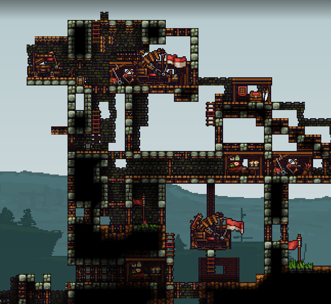
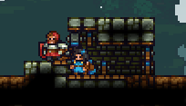

# Builder IV: Offensive playstyle

  

## What you're going to focus on

Offensive builders mainly focus on constantly putting pressure on the enemy, pushing (both with knights and solo), with the goal of seriously damaging enemy structures or getting to the enemy flag, while trying to be as much of an annoyance to the enemies as possible.

## Preparation before pushing

Like all builders, offensive builders also need a lot of materials to push. Unlike other kinds of builders, you're likely to die more often, so you will also need to take materials from your base more often too. This is why you want a few trees in a tree farm -- as many as possible -- and a quarry that's constantly running. If nobody is setting up these things -- you should do it yourself so that you can push efficiently. If nobody in your team is putting wood in the quarry, then you should do that every time you respawn as well.

For pushing, we usually want at least 600 wood (but you can as well go with 1000 if you have lots of wood or trees) and a drill (you want to have one almost every time you push). Having some stone -- usually somewhere between 100 and 200, but if you have more then you can take even up to 500 -- can also be a big advantage for blocking enemy doors.

## Material scavenging

You're actually going to try to use as many of your materials as possible before getting killed (because that's how most pushes end up, and you want as many coins as possible). Since our materials are going to be used pretty fast, you want to scavenge any additional materials you can find on the map. Holding C will highlight all materials and other items useful to you on the map.

<video style="display:block; max-width:100%; height:auto;" src="webm/04-offensive/matscav.webm" controls loop="loop" preload></video> 

If some materials are stuck in a 1 block wide gap, like in the gif below, sometimes you won't be able to pick it up. You can however use a trick to get it closer to you -- just place blocks until it goes up.

<video style="display:block; max-width:100%; height:auto;" src="webm/04-offensive/mattrick.webm" controls loop="loop" preload></video> 

If you have too many materials and there are additional materials laying around, you can quickly use some of what you have -- you can do that by making simple improvements to the mid base or to the tower. This provides lots of coins which can eventually be used for some offensive tactics when you succeed in a push.

## Observing other players

Offensive playstyle will often require you to try to teamwork with random players in your team, as well as often fight against enemies -- both builders and knights. To be more efficient, you should pay attention to who are the best knights in your team -- so that you can rely on them if you're pushing together, as well as know who in your team isn't that advanced and often repeats the same mistakes (such as opening your doors and accidentally letting enemies kill you). You should also observe how good the enemies are and watch what they are doing -- does the opposing team have any good builder? What are they doing -- do they have a plan and try to base expand, gain control of mid or what? Pay attention to the enemy knights as well -- the best knights in the enemy team are also the most likely to kill you and prevent you from succeeding, so you should be wary of them.

## Pushing

As an offensive builder you will want to push at the enemy structures most of the time. There's a lot that you should keep in mind here.

### Skipping mid or not?

Sometimes the enemy may have control of mid, and that can in certain situations be advantageous to you and give you an opportunity to win with a surprise attack. Basically, if the enemies are focused on keeping control of mid and attacking the enemy structures, as well as ratting sometimes, their tower -- and the flagroom -- is likely to not be well-defended. This happens especially if there's a respawn ballista at a mid base; if you get to the enemy base, you're less likely to get noticed because people are respawning at mid instead of the base. This can cause teams to lose sometimes because of a single builder and one or two knights.

The idea is that you want to go through mid and ignore the enemy ballista or tunnel while not getting too much attention (unless you want to get attention and distract the enemies so that your team can regain control of mid). There's a lot that can happen -- sometimes nobody will even go after you, most of the time only two or three knights will try to get to you, while sometimes it'll be the entire enemy team. However, if the enemy team doesn't chase after you or if it's a single person, that's a big opportunity for you. As with any other push, you should focus on doing as much damage as possible or maybe even try to get the flag -- and if that fails, just survive the longest and distract as many enemies as possible.

<video style="display:block; max-width:100%; height:auto;" src="webm/04-offensive/skipmid.webm" controls loop="loop" preload></video> 

Sometimes you can skip mid by getting launched from a catapult at the top of your tower -- if that's possible, you could even get gold and attempt to build a tunnel in the enemy base.

However, keep in mind that you don't always want to skip mid. If your team has problems with defending the tower, you should help with defending or getting control of mid.

### Building quick wooden walls, ledges

Sometimes you may want to quickly make wooden walls in order to skip enemy knights or just not get damaged by them. We're doing it with wood because as mentioned in the first chapter, wood doesn't need as much support from the ground as stone blocks, so we can make over 20 blocks long ledges. This is a great mobility trick that allows you to get past gaps with enemies.

<video style="display:block; max-width:100%; height:auto;" src="webm/04-offensive/ledgeover2.webm" controls loop="loop" preload></video> 

<video style="display:block; max-width:100%; height:auto;" src="webm/04-offensive/ledgeover.webm" controls loop="loop" preload></video> 

### Building food shops

As we mentioned earlier, we want lots of wood for pushing. If you have lots of wood and you get damaged -- by a slash or any enemy arrow -- you should make a food shop and quickly heal. Doesn't matter where you place the food shop -- you can as well place it as soon as you get damaged. You can also make some quick defenses around it if enemy archers are constantly shooting at you. The point is that you should try to not die until you use up all your materials (to get coins, but to not feed the materials to the enemy as well), so there's no point in saving the wood.

<video style="display:block; max-width:100%; height:auto;" src="webm/04-offensive/foodshop.webm" controls loop="loop" preload></video> 

### Analysing enemy tower and making a plan

Pushing is about constantly keeping up pressure and trying to achieve something. It's good to have at least a general goal on what you want to do -- do you want to go on top of the enemy tower and make a knight shop there (and spam kegs if you have coins)? Or maybe you want to collapse a part of it? Or do you just want to annoy the enemies and block all the doors? Or maybe just constantly drill into the flag defenses until one time you are successful?

These are all viable options and we will talk about them in the next sections. Whenever you're in a match, you should look at the enemy tower and analyse its weaknesses to make a plan of action -- for example:

- How many doors does the tower have? How hard would it be to block them all?
- Is there any part of the tower that is made of just stone blocks and would be easily drillable?
- Is there any easy way to get into the enemy knight shop?
- Is there a tunnel or a ballista on top? How hard would it be to get on top of the enemy tower?
- How hard would the tower be to collapse by using various tactics (for example, by bomb arrow spam or just collapsing by destroying backwalls)?

Here are some examples of towers (I tried to pick somewhat good ones, but it's still public CTF) I spotted on random matches on public CTF and what I would do against them as an offensive builder:

This is a pretty good tower -- it's not worth trying to go to the top with your team because there's way too many doors, and even if you managed to get there you can't do much damage. It's also not that easy to collapse. Howver, there's an obvious weakness -- the bottom is very sparsely protected and has no doors. What I would do is make some defenses for myself at the bottom (stone blocks + doors -- yellow colour), then drill through (the arrow) and then quickly block all the enemy doors with stone blocks then drill into the flag. 

If you have an opportunity and there are no enemy knights, you could also attempt to get the enemy keg to do some damage to the tower (and buy more kegs if you have coins). 

It's a decent tower with lots of doors, a ballista and a tunnel, but yet again the bottom doesn't have much protection. What I would do is get through to the bottom part, block all doors with stone blocks (yellow colour) and try to get to the flag (green arrows)

For this tower we have 2 things we could do. For the first variant, if there are not many enemies, you could try climbing up with ladders (green lines) and then get to the ballista (green arrow) while blocking all enemy doors with stone blocks (yellow colour). You can capture the ballista or destroy it. After that, you can drill down to the flag while blocking all enemy doors as well and go back the same way you got in.

The 2nd option is if there are lots of enemies on top that would most likely kill you -- in this case, we place one ladder on the wall, then make some defences around us (2 layers from top -- see 4.5.12) as well as a door from bottom, and then drill to the flag while trying to make use of the corner trick (see 4.6.1) and blocking enemy doors

It's good to also look at the enemy tower and try to analyse its weaknesses whenever you die and wait for respawn.

### Observing knight fights

Similarly to taking mid, the best way to damage enemy tower or get the enemy flag is teamwork -- so you need to know when your knights are succeeding in skirmishes. You should watch how your knights are doing when fighting under the enemy tower or on enemy terrain; check if good knights from your team are there. As soon as they kill the enemies and the opposing team's defense is somewhat weakened, you should start pushing with them. Try to be fast -- the defeated enemies will eventually respawn and get back there.

<video style="display:block; max-width:100%; height:auto;" src="webm/04-offensive/observe2.webm" controls loop="loop" preload></video> 

Your knights won't always succeed though; if they are defeated by enemy knights, you will have to find a less direct way to get to the enemy structures. Sometimes it's better to just retreat and wait for your knights to come back.

<video style="display:block; max-width:100%; height:auto;" src="webm/04-offensive/observe1.webm" controls loop="loop" preload></video> 
You should also watch out for bombs from the enemies -- they may decide to throw some at you and damage or kill you.

### Killing enemy builders for materials

This applies pretty much every time, especially if you have a drill or you have knights with you -- try to kill the enemy builders and get their materials. The more materials you use, the more effective you can be at supporting your knights by spamming doors and spikes, as well as farming coins for buying kegs or making ledges.

For example, in the gif below I was missing wood to build a knight shop, so I killed a builder which had some wood.

<video style="display:block; max-width:100%; height:auto;" src="webm/04-offensive/scavenge.webm" controls loop="loop" preload></video> 

### Scaling the enemy tower -- wallclimbing with stone or wood blocks

You can spam stone blocks below you while constantly jumping and wallclimb the enemy tower. This is usually done when you're pushing solo or there are lots of enemy knights; you also block lots of doors by doing this.

<video style="display:block; max-width:100%; height:auto;" src="webm/04-offensive/blockspam2.webm" controls loop="loop" preload></video> 

Of course, you can do it with wood blocks as well, but they're much easier to destroy for the enemy builders (as well as knights), so they're less effective. If your goal is just to get to the top of the tower however, then feel free to do it.

<video style="display:block; max-width:100%; height:auto;" src="webm/04-offensive/blockspam.webm" controls loop="loop" preload></video> 

### Scaling the enemy tower -- ladders 

Scaling the enemy tower with ladders is most effective if the enemy tower doesn't have many doors and if you have knight support with you. 

<video style="display:block; max-width:100%; height:auto;" src="webm/04-offensive/ladderclimb.webm" controls loop="loop" preload></video> 

Sometimes after placing a few ladders, enemy knights may try to come to you from below. This is a good opportunity to drop spikes and kill them.

<video style="display:block; max-width:100%; height:auto;" src="webm/04-offensive/climbspike.webm" controls loop="loop" preload></video> 

Keep in mind that in certain situations your vertically placed ladders can fall off. This happens if you try to place them next to a single block while there's no backwall either; in order to not fall off, the bottom part of the ladder needs to be placed next to a block as well.

<video style="display:block; max-width:100%; height:auto;" src="webm/04-offensive/ladderfall.webm" controls loop="loop" preload></video> 

This usually happens if you blocked enemy doors and then try building ladders over it. However, there's a simple solution -- you can just rotate the ladders and place them horizontally. They don't fall off in this situation.

<video style="display:block; max-width:100%; height:auto;" src="webm/04-offensive/horizonladder.webm" controls loop="loop" preload></video> 

When you get to the upper parts of the tower by ladder placing, sometimes enemies wil come to the top and will may try to kill you. In this case you want to build a ledge over your head (so that they don't jump down on you) with some doors for your knights, as well as some additional side defenses in case enemy knights still try to jump off and slash you from the side.

<video style="display:block; max-width:100%; height:auto;" src="webm/04-offensive/ladderledge.webm" controls loop="loop" preload></video> 

<video style="display:block; max-width:100%; height:auto;" src="webm/04-offensive/climbdefense.webm" controls loop="loop" preload></video> 

In a situation like that you can either wait for your knights to defeat the enemies or start mining/drilling into the side of the tower.

### Scaling the enemy tower with blocks + ladders

The best way to climb usually is combining the 2 ways -- blocking doors with stone blocks, but placing ladders as well. As mentioned a few sentences ago, use vertical ladders for single blocks.

<video style="display:block; max-width:100%; height:auto;" src="webm/04-offensive/blockladder.webm" controls loop="loop" preload></video> 

### Scaling the enemy tower -- platforms 

Some builders sometimes decide to use platforms facing upwards. This can provide some defense from enemy knights jumping down (as well as from spikes if you place two platforms for each time) and lets your knights climb the tower as well, but keep in mind that platforms are easily destroyable by enemy knights (and sometimes they're able to slash through them as well) and that climbing them is slower than climbing ladders. Moreover, placing platforms is slightly slower than solid stone or wood blocks.

<video style="display:block; max-width:100%; height:auto;" src="webm/04-offensive/platformspam.webm" controls loop="loop" preload></video> 

Keep in mind this is mostly a tactic to annoy the enemies, rather than actually climbing the tower.

### Getting launched from a catapult

You can sometimes get yourself launched from a catapult at your mid base or main tower. If you manage to get to the enemy wall, you should place ladders as soon as possible. Same advice as regarding scaling enemy tower with ladders applies here.

<video style="display:block; max-width:100%; height:auto;" src="webm/04-offensive/catalad.webm" controls loop="loop" preload></video> 

You can hold a chicken for additional distance as well.

Sometimes you can even get launched to the top of the enemy tower.

Another fun thing you can do is get into a crate (hold the crate and press E) and have it picked up by a knight, which is then launched from a catapult.

<video style="display:block; max-width:100%; height:auto;" src="webm/04-offensive/catacrate.webm" controls loop="loop" preload></video> 

### Going into the bottom of the tower

Of course, you won't always want to climb the tower, especially if you can get the flag in an easier way.
Sometimes if the bottom of the tower is sparsely defended you can try going in there. 

A good way is to make some small defences at the bottom of the tower and then start mining/drilling towards it, like in the gif below.

<video style="display:block; max-width:100%; height:auto;" src="webm/04-offensive/towerbot.webm" controls loop="loop" preload></video> 

Let's analyse this structure a bit:

[IMG]

As you can see, we're only making one entrance from the side  -- this is because enemy builders will often try to drop a spike from above and kill you; if there were doors, some knight in your team could open it on accident and get you killed.

However, if there was only one layer of stone blocks, an enemy knight could kill you with a bomb. This is because **bombs can kill you through one layer of solid blocks**. This doesn't happen with platforms or with doors (the doors get damaged and absorb all the damage -- keep in mind that a bomb doesn't even destroy the door fully, it just damages it to around 20% health).

<video style="display:block; max-width:100%; height:auto;" src="webm/04-offensive/through.webm" controls loop="loop" preload></video> 

This is why we make at least two layers -- this requires the enemy knight to use 2 bombs and gives us some more time to get a bit further into the tower.

When we're inside the tower, standard doorfight tactics apply -- just spam doors and rely on your knights. However, don't trust your knights too much in some cases -- for example, you should block top doors with stone blocks instead of doors if you're going to the side, because your knights could open them accidentally and get you killed.

<video style="display:block; max-width:100%; height:auto;" src="webm/04-offensive/blockstone.webm" controls loop="loop" preload></video> 

### Destroying mines

You should also watch out for mines and destroy any you see. It takes two pickaxe hits to destroy every mine. However, there's one bug you should watch out for -- if a mine is stuck in a 1 block wide hole, like in the gif below, hitting it from below will cause it to go through the hole somehow.

<video style="display:block; max-width:100%; height:auto;" src="webm/04-offensive/mina1.webm" controls loop="loop" preload></video> 

What you want to do in situations like this is either block or ignore the mine (if you have knights near you that could accidentally die on the mine), or if possible -- hit the mine, quickly move away, then hit it again, like in the gif below.

<video style="display:block; max-width:100%; height:auto;" src="webm/04-offensive/mina2.webm" controls loop="loop" preload></video> 

### Being on top of tower

After getting to the top of the enemy tower, there are various things you can do. First thing you want to do is block all the enemy doors. Make sure to build a ledge with doors from the side you came from as well so that the enemies don't get to you from there either.

<video style="display:block; max-width:100%; height:auto;" src="webm/04-offensive/climbtower.webm" controls loop="loop" preload></video> 

If you have lots of coins, now is a good moment to use them. What you can do is quickly build a tall wall and a knight shop on top of it, change to knight and then buy kegs and drop them down. Use up all your materials before changing to knight for as many coins as possible. If there are enemy knights that could collapse the wall, you should use stone instead of wood for the bottom part of it. You can use some additional backwalls too or place some ladders for your knights as well.

<video style="display:block; max-width:100%; height:auto;" src="webm/04-offensive/spamkeg.webm" controls loop="loop" preload></video> 

Sometimes people will have a very high column of ladders in their tower, without any additional doors. You can use this to your advantage by dropping a spike and killing a lot of people (Also, if your tower has that too, you should fix that).

<video style="display:block; max-width:100%; height:auto;" src="webm/04-offensive/towerspike.webm" controls loop="loop" preload></video> 

Of course you can do that much more easily if the enemy tower has lots of backwalls and not many solid blocks.

<video style="display:block; max-width:100%; height:auto;" src="webm/04-offensive/spikesimple.webm" controls loop="loop" preload></video> 

### Destroying enemy tunnel

Pretty much same advice here applies as regarding destroying mid base tunnel; however, there's one additional thing that you can do if the tunnel is on top of the enemy tower. Basically, collapsing blocks destroy doors and shops when they fall down. You can make a chunk of wood supported by one backwall and then collapse it like in the gif below to destroy enemy doors and shops.

<video style="display:block; max-width:100%; height:auto;" src="webm/04-offensive/tunneldie.webm" controls loop="loop" preload></video> 

This can sometimes apply in other situations too -- for example for destroying a mid tunnel.

<video style="display:block; max-width:100%; height:auto;" src="webm/04-offensive/midtunneldestroy.webm" controls loop="loop" preload></video> 

You can also do this when there are no doors, but this will require destroying a block like in the gif below.

<video style="display:block; max-width:100%; height:auto;" src="webm/04-offensive/tunnelcollapse1.webm" controls loop="loop" preload></video> 

Keep in mind that this only applies to doors. If you ever find yourself in a situation like this but on the defense, you can counter it by just replacing your top doors with wood or stone blocks. 

### Buying kegs in enemy knight shop

Although spamming kegs from top of the tower is good, in some situations buying them in the middle of the enemy base will be more effective. The idea is to get to the enemy knight shop and buy some kegs, then light as many as you can. One keg's explosion will light the other kegs and you will do a lot of damage to the enemy tower.

<video style="display:block; max-width:100%; height:auto;" src="webm/04-offensive/kegspam.webm" controls loop="loop" preload></video> 

Sometimes enemies will buy a water bucket and extinguish the kegs (even through doors). If this happens, just light the keg again.

There's one thing you should also know -- if a keg explodes near a shop, the shop is going to absorb some of the damage from the keg and the backwall behind the shop won't be damaged. This means that in some cases you will actually need at least 2 kegs for even a thin tower (unless you destroy the shops first)

<video style="display:block; max-width:100%; height:auto;" src="webm/04-offensive/absorbshop.webm" controls loop="loop" preload></video> 

### Collapsing the tower

Besides using kegs, you can try to collapse the tower in a different way. If you have a lot of knights with you, but getting to the flag at the current moment would be a bit tricky, you should definitely attempt to collapse the tower.

The best way to collapse a tower is to try to notice the fastest way of destroying its support and noticing kind of a line. Example "line" is the highlighted blocks in the image below -- destroying these blocks (if you don't have a drill for solid blocks) would be the fastest way to collapse.

You want to use a drill for solid blocks such as wood or stone (try to find a "line" with as many as possible -- of course if you have  a drill), avoid wasting time on destroying doors unless necessary and finish by destroying backwalls. If you don't have a drill, focus on backwalls only.

<video style="display:block; max-width:100%; height:auto;" src="webm/04-offensive/drillcollapse.webm" controls loop="loop" preload></video> 

There's a trick which lets you destroy backwalls quicker: basically, if you hit a stone backwall one time with your pickaxe, you can replace it with a wooden backwall, which is then much easier to destroy than a slightly damaged stone backwall. 

<video style="display:block; max-width:100%; height:auto;" src="webm/04-offensive/backwallreplace.webm" controls loop="loop" preload></video> 

Comparison:

<video style="display:block; max-width:100%; height:auto;" src="webm/04-offensive/replacecomparison.webm" controls loop="loop" preload></video> 

With replacement, one stone backwall takes 1 hit, replacement, 2 more hits to destroy

Without replacement, one stone backwall takes 5 hits to destroy

### Using enemy tunnels

Not that strictly related to pushing, but sometimes you can use an enemy tunnel (for example their mid base one) to travel to another one (tent one or tower one). However, you should be careful and check earlier (for example when waiting for respawn) if the enemy tunnel you're travelling to has a sawtrap. You should be wary of enemy mines on the tunnels as well (they'll instantly kill you).

<video style="display:block; max-width:100%; height:auto;" src="webm/04-offensive/tunneluse.webm" controls loop="loop" preload></video> 

There's also a trick that can actually let you avoid sawtraps. The idea is to place a ladder in the room with the tunnel and while climbing both vertically and horizontally on the ladder (holding W + A/D) use the tunnel. This will make you move slightly after teleporting to the other tunnel and avoid the sawtrap. Other players in your team can do this as well.

<video style="display:block; max-width:100%; height:auto;" src="webm/04-offensive/laddertrick.webm" controls loop="loop" preload></video> 

In the gif above, you would get killed in the saw if you used the tunnel without the ladder trick.

This however can also be countered if the spot with the sawtrap is 6 blocks wide and has two sawtraps instead of only one.

<video style="display:block; max-width:100%; height:auto;" src="webm/04-offensive/2saws.webm" controls loop="loop" preload></video> 

### Falling down on collapsing blocks

If you're on a ledge high over the ground, sometimes you may want to go to the bottom. You can collapse 2-3 wooden blocks and then fall down on them slowly to not get any fall damage.

<video style="display:block; max-width:100%; height:auto;" src="webm/04-offensive/falldown.webm" controls loop="loop" preload></video> 

### Making a tunnel in the middle of the enemy base

Sometimes you can end up destroying the tunnel in the enemy tower and may have gold. If you have other mats, you can try building a tunnel for your own team. This is a bit risky, but if done well it can cause a quick victory.

<video style="display:block; max-width:100%; height:auto;" src="webm/04-offensive/enemybasetunnel.webm" controls loop="loop" preload></video> 

<video style="display:block; max-width:100%; height:auto;" src="webm/04-offensive/tunnelbuild.webm" controls loop="loop" preload></video> 

You can combine it with the ladder trick from "Using enemy tunnels" section as well. In the gif below, first I travelled to it by using the ladder trick, then destroyed it and used the gold to make my own.

<video style="display:block; max-width:100%; height:auto;" src="webm/04-offensive/anothertunnel.webm" controls loop="loop" preload></video> 

## Combat

Although builder isn't a combat class, as an offensive builder you want to be somewhat good at killing people for maximum effectiveness as well (it's also quite fun).

### Using doors at certain corner angles to damage knights 

This is arguably the most powerful combat trick for builders; there's a certain angle which lets you damage knights by pickaxe and drills without them being able to damage you by slashes. In the image below, the knight is unable to damage you by slashing (unless by a generally unknown trick that I'll mention later), while you're able to damage them by a pickaxe or drill.

Basically, the way it works is that whenever a knight attack a door, the door absorbs the damage of the slash/jab and the slash/jab's arc (which starts from the top) doesn't continue past the door. In this situation, the knight can only attack the door. You can however still attack them.

<video style="display:block; max-width:100%; height:auto;" src="webm/04-offensive/angledoor.webm" controls loop="loop" preload></video> 

You can often force yourself into such situations by being at a lower level than the enemy players and placing doors properly.

<video style="display:block; max-width:100%; height:auto;" src="webm/04-offensive/angledrill2.webm" controls loop="loop" preload></video> 

Knights will often think that they should be able to damage you and get closer to you. You can also place a block behind them when they get close so that they don't run away.

<video style="display:block; max-width:100%; height:auto;" src="webm/04-offensive/angleblock.webm" controls loop="loop" preload></video> 

Make sure to not open the door accidentally -- the enemies can go through it and then be able to kill you.

Now, the thing is, that the enemy knight is actually able to slash you by starting his slash so that it doesn't hit the door and then moving the slash arc to hit the enemy builder (starting the slash from the opposite side and quickly moving the direction he's pointing to by 180 degrees with his mouse downwards, not hitting the door at all)

<video style="display:block; max-width:100%; height:auto;" src="webm/04-offensive/trickangle.webm" controls loop="loop" preload></video> 

However, barely anyone knows about this and you'll be able to kill a majority of the knights without getting any damage.

This angle works similar in a situation like in the gif below as well, but if the knight doesn't aim directly at you they may sometimes damage you. It's also a bit more dangerous to try damaging them at this angle because it's easier to accidentally open the door.

<video style="display:block; max-width:100%; height:auto;" src="webm/04-offensive/swapplace.webm" controls loop="loop" preload></video> 

Keep in mind that enemy builders can attack you at both of these angles -- it's just knights who can't.

### Enemy knights glitching in the doors

Sometimes if you open doors for a short moment for the enemy knights and they have slight lag, they will get stuck in a closed door and you will be able to damage them while they won't be able to.

<video style="display:block; max-width:100%; height:auto;" src="webm/04-offensive/glitch.webm" controls loop="loop" preload></video> 

### Pickaxe 1v1 with other builders

Whenever you're doing a 1v1 with other builders, you should try to spike them first somehow to get a heart advantage and then finish them with a pickaxe. If you don't have any way to do that, then the result of the 1v1 will depend on whoever damaged the enemy player first. To do that, you should start attacking them with your pickaxe as soon as they're in your range.

[GIF]

<video style="display:block; max-width:100%; height:auto;" src="webm/04-offensive/1v1.webm" controls loop="loop" preload></video> 

Another way to win the 1v1 is to heal yourself -- eat a burger, a fish or use a heart to heal yourself after losing some health. You can eat it by using the Eat Food bind (V key by default). Try to use food at as low health as possible, because the enemy may have food too. In the gif below, I eat a burger with the V key right after getting hit 5 times (so one hit away from death -- half a heart).

<video style="display:block; max-width:100%; height:auto;" src="webm/04-offensive/eat.webm" controls loop="loop" preload></video> 

Generally try to not engage in pickaxe 1v1s if you have fewer hearts than the enemy.

Spamming the right mouse button instead of holding it makes no difference.

### Heating drill before combat

Since the drill does more damage when at least 50% heated, sometimes before engaging in a 1v1 with a builder that has a drill you may want to heat your own drill slightly for more damage (1.5 heart of damage instead of 1). You can do it by using it for a moment on any blocks.

<video style="display:block; max-width:100%; height:auto;" src="webm/04-offensive/heatdrill.webm" controls loop="loop" preload></video> 

Keep in mind that the drill usually overheats after that (if it was heated to the point of doing more damage) and will drop to the ground, so don't do this if there are more than one enemy builder around.

### Hiding drill from enemy builder

You can try to make the enemy builder think that you have no drill by keeping it in your inventory and provoke them to attack you, and then take it out and kill them.

<video style="display:block; max-width:100%; height:auto;" src="webm/04-offensive/drillhide.webm" controls loop="loop" preload></video> 

### Using pickaxe + drill at the same time

You can use a drill and a pickaxe at the same time on enemies for extra damage (hold both left and right mouse buttons).

[GIF]

You however can't do this against blocks -- only enemies.

You should do this especially in underwater fights, where drills are slower and the enemy can damage you more with a pickaxe.

### Overheating enemy builder's drill

Sometimes you may want to not fight against a builder with a drill -- especially if you don't have one yourself. The idea is to bait them and get them to drill doors in a doorfight -- spam lots of doors. They may overheat their drill on your doors. If you don't have a drill yourself, you will want to wait a short while (you can't pick up a drill right after it overheated) -- about 1 second -- and pick it up from the ground. You can also use the drill to kill the enemy (make sure to not just instantly overheat it again though).

[GIF]

If you already had a drill, you can just attack the enemy right after their drill got overheated.

<video style="display:block; max-width:100%; height:auto;" src="webm/04-offensive/baitenemi.webm" controls loop="loop" preload></video> 

### Spamming overheated drill

If you get stuck in a place with enemies but there's an overheated drill on the ground, you should hold right mouse button (to damage enemies with pickaxe) while spamming C and left mouse button at the same time to quickly damage enemies with the steaming drill before it falls down again. Keep in mind that picking up a steaming overheated drill does 0.25 heart of damage, so don't do this if you don't have enough health.

<video style="display:block; max-width:100%; height:auto;" src="webm/04-offensive/spamdrill.webm" controls loop="loop" preload></video> 

### Killing knights with low health

You can easily kill knights that have low health (1 heart), even with your pickaxe -- attack them in between their slashes (wait for them to miss a slash, then attack).

<video style="display:block; max-width:100%; height:auto;" src="webm/04-offensive/lowhpknight.webm" controls loop="loop" preload></video> 

### Offensive spiking

You can drop spikes at enemies in a lot of situations. You can make use of the door-related corner angle mentioned earlier as well. Some examples are in the gifs below

<video style="display:block; max-width:100%; height:auto;" src="webm/04-offensive/combatspike.webm" controls loop="loop" preload></video> 

<video style="display:block; max-width:100%; height:auto;" src="webm/04-offensive/combatspike2.webm" controls loop="loop" preload></video> 

<video style="display:block; max-width:100%; height:auto;" src="webm/04-offensive/combatspike3.webm" controls loop="loop" preload></video> 

Waiting for enemy to open door before dropping spike (spikes go through opened doors):

<video style="display:block; max-width:100%; height:auto;" src="webm/04-offensive/spikedoor.webm" controls loop="loop" preload></video> 

### Dirt spikes against enemies digging down

If the enemies are digging down towards you, you can place some spikes on dirt (or on wood) right before they fall down and damage them. This can of course be countered by placing ladders, but it still works sometimes.

<video style="display:block; max-width:100%; height:auto;" src="webm/04-offensive/spikedirt.webm" controls loop="loop" preload></video> 

### Escape spikes

If you're escaping from a knight and there's some backwall around, you can drop spikes as the enemy is going towards you and damage them or even kill them.

<video style="display:block; max-width:100%; height:auto;" src="webm/04-offensive/escapespike.webm" controls loop="loop" preload></video> 

You can also place some ladders and spike them as they get close.

<video style="display:block; max-width:100%; height:auto;" src="webm/04-offensive/escapeladder.webm" controls loop="loop" preload></video> 

### Double hit spikes

Spikes can deal two hearts of damage by hitting the same enemy twice. If the enemy is jumping towards you, you should place a spike below them slightly to the side right as they fall down. They will be hit by the spike from the side and then the spike will hit them again, like in the gif below.

<video style="display:block; max-width:100%; height:auto;" src="webm/04-offensive/doublehitspike.webm" controls loop="loop" preload></video> 

### Collapsing blocks on enemies

Collapsing blocks do a lot of damage, even to shielding knights. A good trick is to make some ladders and then some wood blocks -- the enemy knights will likely destroy the ladders and cause the wood blocks to collapse on themselves.

<video style="display:block; max-width:100%; height:auto;" src="webm/04-offensive/collapsekill.webm" controls loop="loop" preload></video> 

### Stomping

You can fall down on enemy builders (as well as knights, but that's a bit more dangerous) to stomp them while dealing some damage and stunning them. You can combine it with using a spike right after (if there's backwall), drilling them or hitting them with your pickaxe.

<video style="display:block; max-width:100%; height:auto;" src="webm/04-offensive/stomp1.webm" controls loop="loop" preload></video> 

<video style="display:block; max-width:100%; height:auto;" src="webm/04-offensive/stomp2.webm" controls loop="loop" preload></video> 

### Crouching

Crouching is when you hold down the S (move down) button. This causes your collision hitbox to disappear -- enemies will be able to go through you. You can't move for this to work (if you move, they'll collide with you even if you hold S), but you can still attack (by pickaxe or by using  a drill). This can be used to avoid being stomped by enemies. You can also attack enemies that get stunned from fall damage right after crouching.

<video style="display:block; max-width:100%; height:auto;" src="webm/04-offensive/crouch2.webm" controls loop="loop" preload></video> 

<video style="display:block; max-width:100%; height:auto;" src="webm/04-offensive/crouchdrill.webm" controls loop="loop" preload></video> 

### Dirt spike + crouch

This doesn't work very often, but if enemies are digging downwards towards you, you can place dirtspikes (spikes on dirt/bedrock/wood etc.) below yourself and then crouch and have them fall down into the spikes. You can then jump out right after they get damaged and block them.

<video style="display:block; max-width:100%; height:auto;" src="webm/04-offensive/crouchspike.webm" controls loop="loop" preload></video> 

### Catching and throwing back enemy bombs

Enemy knights can sometimes throw a bomb too early or die right after lighting a bomb and give you enough time to catch it and throw it somewhere else.

<video style="display:block; max-width:100%; height:auto;" src="webm/04-offensive/bombthrow.webm" controls loop="loop" preload></video> 

<video style="display:block; max-width:100%; height:auto;" src="webm/04-offensive/bombcatch.webm" controls loop="loop" preload></video> 

In the gif below, I've quickly caught the bomb and threw it at a distance so that it would only do 1.5 hearts of damage instead of instantly killing me.

<video style="display:block; max-width:100%; height:auto;" src="webm/04-offensive/bombthrow2.webm" controls loop="loop" preload></video> 

(Unrelated, but you can also notice crouching to not get stomped by enemy)

If you're being attacked by several enemies at once, you can catch an enemy bomb and suicide with it to try to kill some enemies.

[GIF]

## Playing with a knight friend

Playing as an offensive builder+knight duo in public CTF matches in my opinion is one of the best ways to experience KAG. Since you don't have to rely on random people you can play much better and win stalemates by teamwork, as long as your knight defends you and supports you as much as they can: follows you, catches enemy bombs so that they don't damage you, gives you materials from enemy builders and helps you during doorfights.

[GIF]

Besides launching yourself from a catapult in a crate held by a knight, as mentioned earlier, your knight friend can also bomb jump with you in a crate.

<video style="display:block; max-width:100%; height:auto;" src="webm/04-offensive/cratejump.webm" controls loop="loop" preload></video> 

If your knight friend drops resupply materials when respawning (changes to builder and back to knight), you'll also have more materials and be more effective at pushing.

<video style="display:block; max-width:100%; height:auto;" src="webm/04-offensive/matdrop.webm" controls loop="loop" preload></video> 
