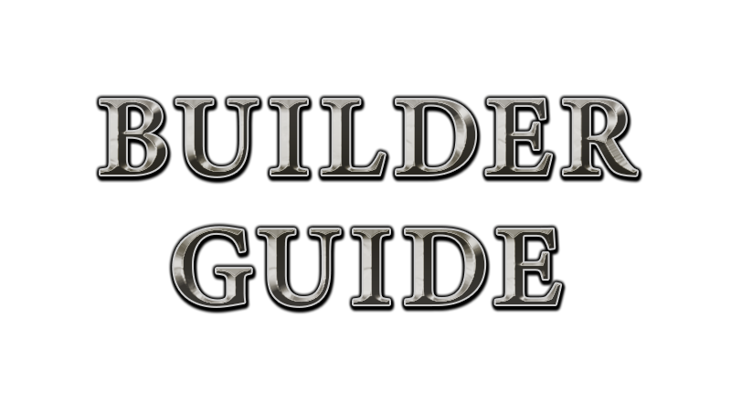

--
title: "Builder Guide"
subtitle: "The tactical class of KAG"
author: "by Bunnie"
date: "`r format(Sys.time(), '%d/%m/%Y')`"
site: bookdown::bookdown_site
output: bookdown::gitbook
documentclass: book
bibliography: [latex/book.bib, latex/packages.bib]
biblio-style: apalike
link-citations: yes
github-repo: deynarde/kag-builder-guide
description: "A KAG builder guide for both new and experienced players."
---

# Introduction {-}

  

Builder is probably the most advanced class to play in KAG. It's different from the other classes -- from a certain point of view, a Builder can do the most for their team out of all classes. It's mostly a tactical class, although having good reflexes will sometimes help you too; however, not as much muscle memory is needed as for the Knight class.

Although this guide is for everyone -- from newbies to players with some experience already -- it'd be good if you already completed the in-game Basics and Capture The Flag tutorials and knew the obvious stuff such as the controls and basic mechanics: mining, building, wallclimbing, changing class, picking up items etc.

The guide has a few chapters, which you can see and browse on the left part of the website.

> If you have any questions about the builder class, you can contact me at the [KAG Discord] (https://discord.gg/kag) - my tag is `bunnie#8553`.
>
> Big thanks to all members of the HOMEK clan which I am the leader of -- especially deynarde for setting this website up, as well as all the people regularly playing Captains which helped me learn Builder.
